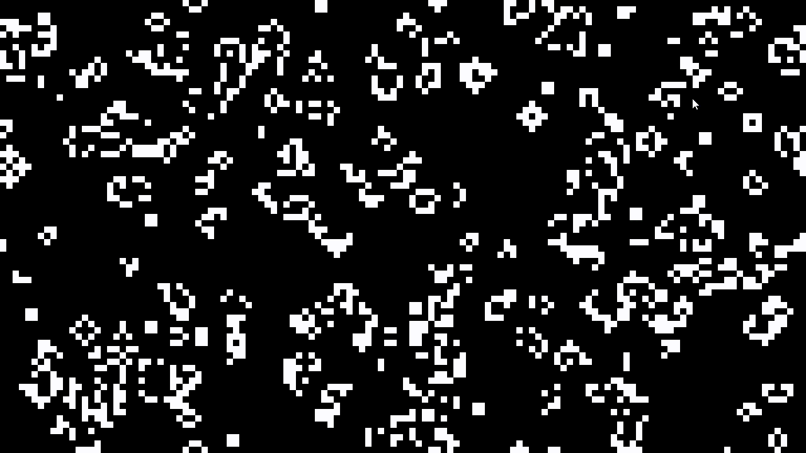

# The Game of Life

The Game of Life, also known simply as Life, is a cellular automaton devised by the British mathematician John Horton Conway in 1970.

You can read more about it [here](https://en.wikipedia.org/wiki/Conway%27s_Game_of_Life)

This is an implementation of the automaton for learning purposes.

Controls:

- Spacebar - Pause
- Left Click - Make new cell at cursor position
- Right Click - Delete cell at cursor position
